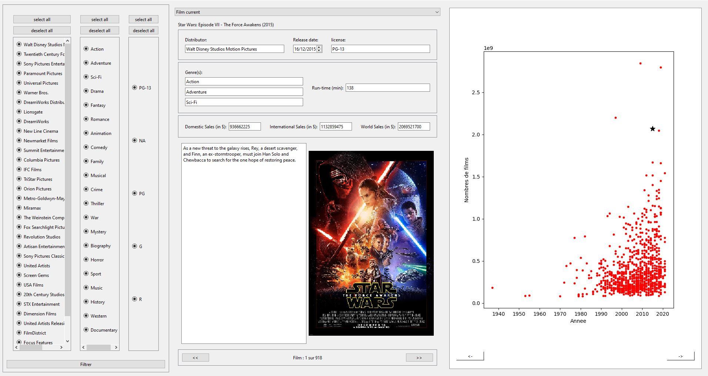
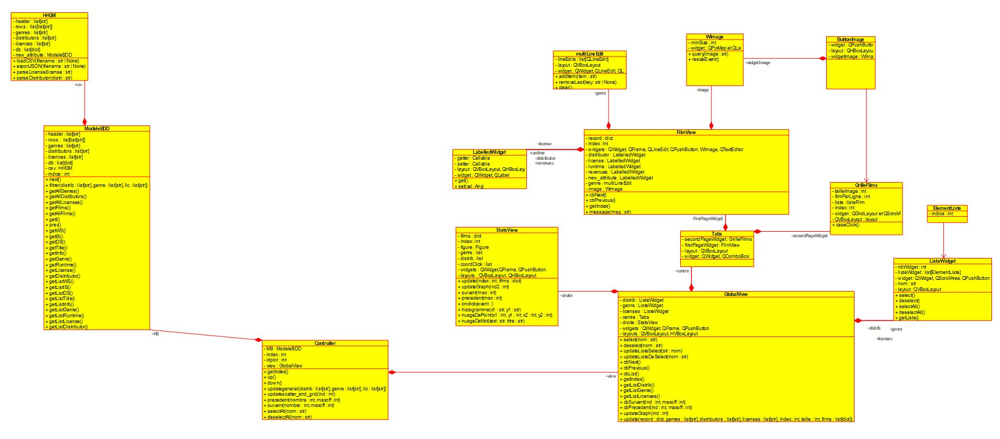
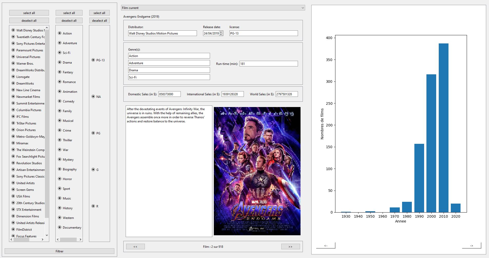
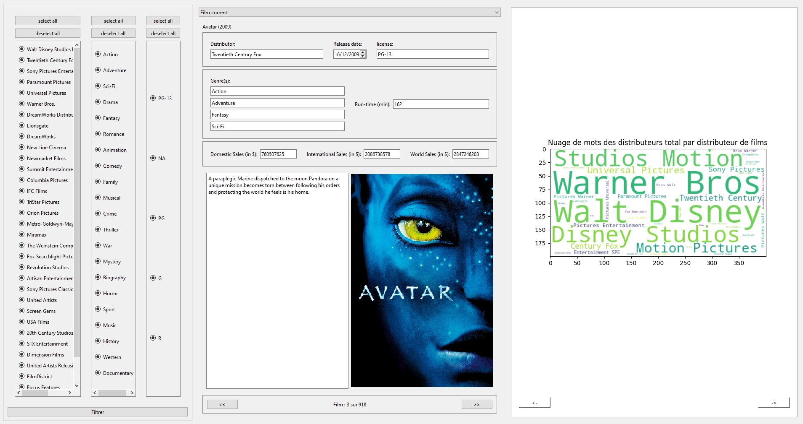
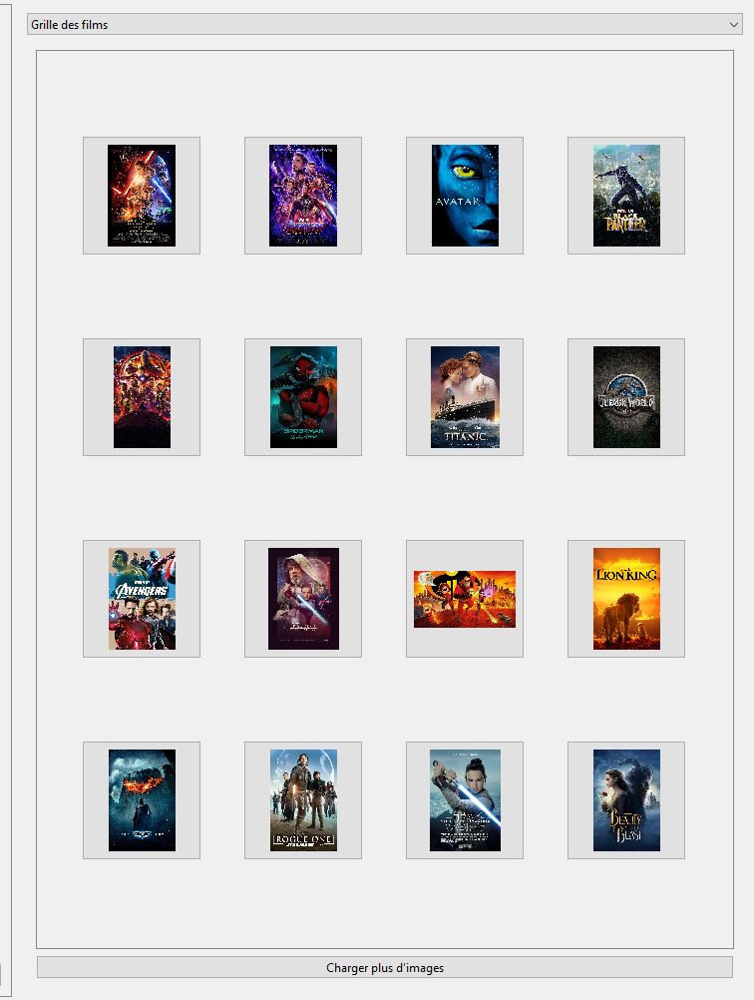

[](https://opensource.org/licenses/) [](https://www.python.org/downloads/)

# **Film Data-visualisation Software**

## **The project 📢**

The project aims at realizing the deminer game an application that is a visualization tool
and decision support on the different data of the film market in a simple and understandable way and with different points of view in order to
to know the success factors of a movie under PyQt with the MVC architecture.

Data: 
  - https://www.kaggle.com/datasets/tmdb/tmdb-movie-metadata
  - https://www.kaggle.com/datasets/rounakbanik/the-movies-dataset
  - https://www.kaggle.com/datasets/narayan63/netflix-popular-movies-dataset

The documentation is the application is in French





## **The prerequisites 📍**

### Language 📙

This project runs on python, I recommend using version 3.10 Python.

Python : https://www.python.org/

### Libraries 📚

> #### 1. PyQt 

**PyQt is a library that allows to link the Python language with the Qt library.
This one allows to create interfaces by proposing different tools.

```
pip install pyQt6
```

PyQt : https://doc.qt.io/qtforpython/ 


> #### 2. Numpy

The **_Numpy_** library is a library for manipulating matrices or multidimensional arrays

```
pip install numpy
```

Numpy : https://numpy.org/

## **How to use the application ❓**

First of all download or forker the whole project to have all the files.

### Run the program ▶️

> #### 1. With VSC 👨💻

To use the program from the code, you need to run (start) the **Controller.py** file through a code editor like VSC.

VS code: https://code.visualstudio.com

> #### 2. With the console 💻

With powershell or the unix shell go to the folder where the files are located then execute this command :
```
python Controller.py
```


### The application 🎲

It is possible to explore all the movie files
with radio buttons that allow you to filter the distributors, the film
distributors, film genres and license with the possibility to select or deselect
select or deselect in each category.

Each record contains the name of the film, the distributor, the release date
the license, the genre(s), the duration of the film in minutes, the domestic
domestic, international, worldwide sales in dollars, their
description as well as an image corresponding to the film's poster. 

The bulleted list containing all the film titles, from which it is possible to
in which it is possible to select a film and to navigate with buttons before and
buttons at the bottom of each file with the visualization of it

The interface also has a main menu containing a grid
with movie posters and titles.

Depending on the filtering, the application has a
a scatter plot that is updated with each interaction
allowing to show the evolution of the sales, over the last x years
(x is the number of years chosen), and z producers (z being a set of producers or
producers or distributors)

Depending on the movie that is consulted on the application, the corresponding point of the
corresponding scatterplot will be highlighted by a change of color.
change of color.


### Screenshots of the interface 📸







# Authors
    - CZARKOWSKI Matthieu
    - CORION Gauthier
    - MOURONVAL Laurane
    - HAFFNER Aurélian
    - DESSAILLY Léandre
